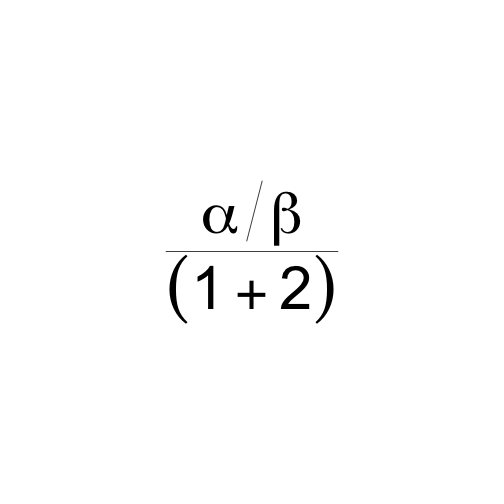
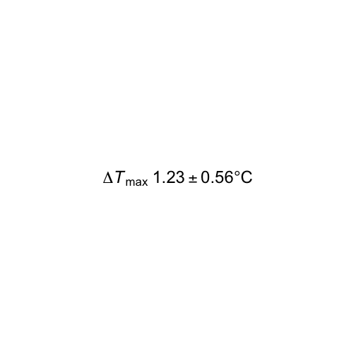
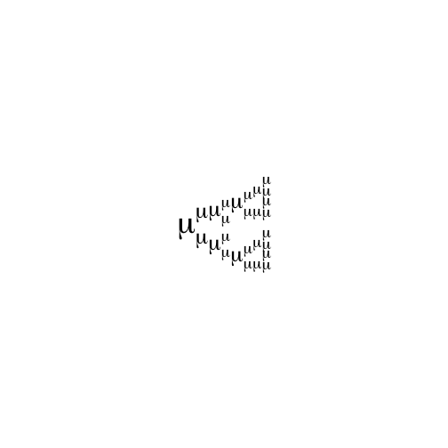
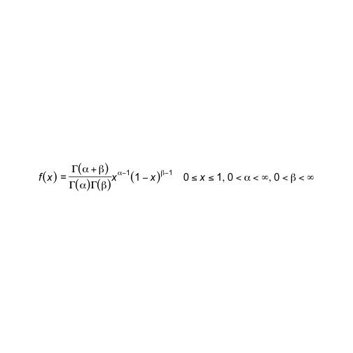

Rationale
------------------------------------------------------------------------------

"That's a compact and expressive DSL you have there for writing math equations 
given the constraints of the R language, it'd be a shame if someone were to 
expand it into an almost redundant and useless set of functions." - **#rstats mafia**


Introduction
------------------------------------------------------------------------------

`funcmath` is a small library for building plotmath expressions via functions.

Some programmers use the term *convenience functions* 
i.e. "A convenience function is a non-essential subroutine in a programming 
library or framework which is intended to ease commonly performed tasks."

`funcmath` is a set of *inconvenience functions* to expand the compact plotmath syntax 
into a set of functions.

For example, instead of a nice compact plotmath expression such as:


```r
m <- bquote(frac(alpha/beta, (1 + 2)))
```

... why not use defined symbols in `funcmath` (such as `alpha`) and infix functions like `%/%`?


```r
m <- frac(alpha %/% beta, b(1 %+% 2)) 
```





Installation
------------------------------------------------------------------------------


```r
devtools::install_github('coolbutuseless/funcmath')
```


Actual rationale
------------------------------------------------------------------------------

This work arose out of my attempts at creating fractals with plotmath expressions,
and was not really meant as a way of creating *actual* math expressions.


Example #1
------------------------------------------------------------------------------

A plotmath expression created using `bquote()`:


```r
# http://lukemiller.org/index.php/2017/05/r-plotmath-functions-combined-with-variable-values/
mymean  <- 1.2345678
mySE    <- 0.55555
mylabel <- bquote(Delta*italic(T)[max]~.(format(mymean,digits=3))*''%+-%''*
                .(format(mySE,digits=2))*degree*C)
# mplot(mylabel, cex=2)
```


A plotmath expression created via `funcmath`:


```r
Delta %*% 
  italic('T') %_% 'max' %space% format(mymean,digits=3) %+-% 
  (format(mySE,digits=2) %*% degree) %*% 'C' %>% 
  mplot(cex=2)
```




Example #2 - Sierpinski Fractal
------------------------------------------------------------------------------


```r
s <- function(x) { x %_% x %^% x }

mplot(s(s(s(mu))))
```




Example #3 - Beta distribution 
------------------------------------------------------------------------------

An issue with the normal way of building plotmaths expressions is that
it is usually all done in one statement, which makes debugging complex math problematic. e.g. beta distribution


```r
# https://blog.snap.uaf.edu/2013/03/25/mathematical-notation-in-r-plots/
expr.beta <- expression(italic(paste(displaystyle(f(x)~"="~frac(Gamma(alpha+beta),Gamma(alpha)*Gamma(beta))*x^{alpha-1}*(1-x)^{beta-1})
                    ~~~~displaystyle(list(paste(0<=x) <=1, paste(0<alpha) <infinity, paste(0<beta) <infinity))
                    )))

mplot(expr.beta, cex=1.25)
```




By exploding plotmath into a set of functions, `funcmath` allows you to compose individual parts of an math expression and then
combine them later.   Individual parts can be tested separately and finally merged into the total required expression.

The result is more verbose, uglier and requires learning a whole new set of functions - this is called a *win-win-win* situation!


```r
lhs         <- 'f' %*% b('x')
numerator   <- Gamma %*% b(alpha %+% beta)
denominator <- (Gamma %*% b(alpha)) %*% (Gamma %*% b(beta))
right       <- 'x' %^% (alpha %-% 1) %*% b(1 %-% 'x') %^% (beta %-% 1)
limitx      <- 0 %<=%  'x'  %<=% 1
limitalpha  <- 0 %<<% alpha %<<% infinity
limitbeta   <- 0 %<<% beta  %<<% infinity

limits <- list_(limitx, limitalpha, limitbeta)

total  <- lhs %eq% (numerator %frac% denominator) %*% right %space4% limits 

italic(displaystyle(total)) %>% mplot(cex=1.25)
```


Issues
------------------------------------------------------------------------------

* There are a **lot** of namespace clashes e.g. `list`, `paste`, `%*%` etc.
* Some names have an appended underscore to avoid clashing with a builtin/common 
  function i.e. `list_` instead of `list`
* I stored all the symbols/glyphs in a list structure named `g`.  This isn't 
  particularly elegant, but it avoids some of namespace polution.


